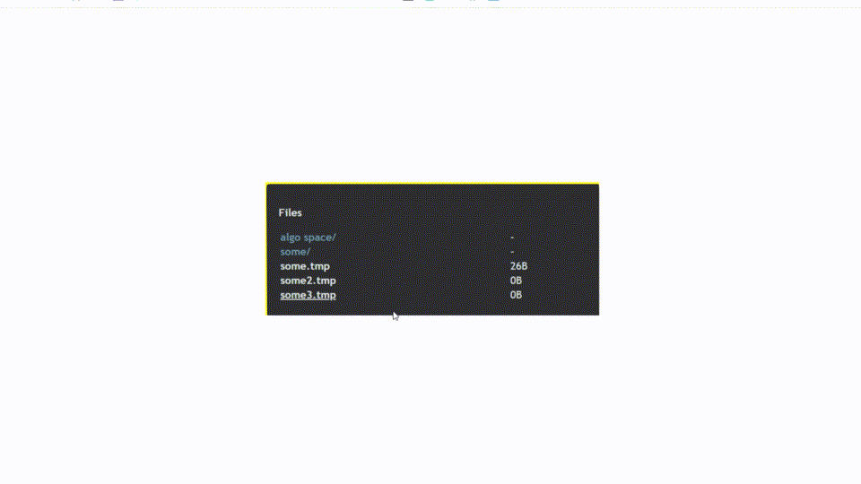

# Simple Download Server

## Description

Minimalistic server for sharing files from a specific directory.

**Demo:**


**Why should I use this application?**

- After compiled the total size of the script is only **0.59MB**
- TypeScript is used to develop the application (Object-Oriented)
- The setup with docker is already done (half of the work is done for deployment)
- Change/Modify styles is as simple as modifying the views

## Use locally

```shell
npm install
RESOURCES=./public/ PORT=3001 npm start

# start with user/password (optional)
D_USERNAME=user D_PASSWORD=pass RESOURCES=./public/ PORT=3001 npm start
```

## Build

```shell
npm run build

# start built project
RESOURCES=./public/ PORT=3001 node ./dist/main.js

# start with user/password (optional)
D_USERNAME=user D_PASSWORD=pass RESOURCES=./public/ PORT=3001 node ./dist/main.js
```

## Use with docker-compose

### Define environment variables

Before start docker the following environment variables are needed:

- `SERVER_PORT`: basically the port from which the server will be available.
    - exam: `SERVER_PORT=7852`
- `DIRECTORY_TO_SHARE`: the complete path to the directory to be shared.
    - exam: `DIRECTORY_TO_SHARE=/home/app/folder/` 
- `D_USERNAME` *(optional)*: the username if you want to add security.
- `D_PASSWORD` *(optional)*: the password if you want to add security.

> NOTE: The easy way to setup the environment variables is to create the .env file

### start docker container
```shell
docker-compose up -d --build
```

## Deploy image to docker hub

```shell
# build image with tag (update the tag version)
docker build -t simple-download-server .

# set this version as latest
docker image tag simple-download-server ggjnez92/simple-download-server:1.2.0
docker image tag simple-download-server ggjnez92/simple-download-server:latest

# push image to docker hub
docker image push ggjnez92/simple-download-server:1.2.0
docker image push ggjnez92/simple-download-server:latest
```

## ToDo

- [ ] Add integration tests

## Technologies used

- [TypeScript](https://www.typescriptlang.org/)
- [Docker](https://www.docker.com/)
- [Webpack.js](https://webpack.js.org/)
- [Express.js](https://expressjs.com/)
